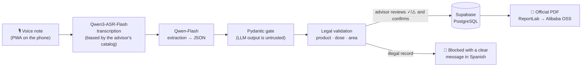

# AgroVoz — voice-to-legal phytosanitary records

**A GIP advisor dictates a 10-second voice note in the field; AgroVoz turns it
into a legally valid phytosanitary record.** On 2027-01-01, electronic
phytosanitary records become mandatory for every farm in Spain (RD 1311/2012,
EU Regulation 2023/564) — but the advisors who create them work standing in a
field, with dirty hands and no time for forms.

> *"Finca de Pepe, Abamectina 1,5 litros por hectárea, araña roja, tractor"*
> → transcription → field extraction → **legal validation** → PostgreSQL →
> official PDF.

**🔗 Live demo:** <https://agrovoz.pedrofloresnavarro.com> (deployed on
Alibaba Cloud ECS)

<!-- 📸 TODO: hero GIF — the money shot for judges. Screen-record the phone:
     tap record → dictate the demo phrase → review screen with ✓/⚠️ markers →
     confirm → open the PDF. 10–20 s, looped. Save as docs/img/demo.gif -->


## 🏆 Hackathon submission

**Event:** Global AI Hackathon Series with Qwen Cloud — **Track 4: Autopilot
Agent**.

| Track requirement | Where AgroVoz delivers it |
| --- | --- |
| Ambiguous inputs | Free-form field Spanish, one button for three record types (the LLM classifies the audio); per-advisor ASR biasing + fuzzy resolution turn *"amavectina en la finca de Pepe"* into registered catalog entities |
| External tools | DashScope (Qwen3-ASR-Flash + Qwen-Flash) · Supabase (PostgreSQL + OTP auth) · Alibaba Cloud OSS · Open-Meteo · ReportLab |
| Human-in-the-loop checkpoints | Review-before-persist with per-field ✓/⚠️ markers — nothing from the LLM reaches the legal record unseen; execution confirmation and twice-per-campaign validations are explicit advisor sign-offs |
| Production-readiness | Legal validation engine (blocks illegal records), idempotent offline queue, soft-delete audit trail with 3-year retention, deployed on Alibaba Cloud ECS |

- **🎬 Demo video:** `TODO`
  <!-- 📸 TODO: add the YouTube link before submitting. -->
- **Alibaba Cloud usage in code:**
  [`app/adapters/outbound/qwen.py`](app/adapters/outbound/qwen.py)
  (DashScope: ASR + extraction) ·
  [`app/adapters/outbound/oss_storage.py`](app/adapters/outbound/oss_storage.py)
  (OSS: audio + PDFs) · deployed on an Alibaba Cloud ECS instance
  ([`docs/SETUP.md`](docs/SETUP.md)).
- **How AgroVoz uses Qwen Cloud:** Qwen3-ASR-Flash with **per-advisor context
  biasing** (the advisor's registered catalog injected before transcription) +
  Qwen-Flash extraction with **versioned few-shot prompts** in field Spanish →
  a strict Pydantic gate (LLM output is untrusted input).
- **License:** MIT.

**For judges — 5-minute tour:** watch the demo video, then the system diagram
in [`docs/ARCHITECTURE.md`](docs/ARCHITECTURE.md), then the outcome matrix in
[`docs/USER_GUIDE.md`](docs/USER_GUIDE.md) §3.3 — every dictation and how the
legal engine answers it.

## How it works



What makes it more than a transcription toy:

- **Legal validation engine** — refuses to persist an illegal record: product
  authorized, dose ≤ the registered maximum (**with unit conversion** — 0.5
  hl/ha does not slip past a 1.5 L/ha cap), treated area ≤ the SIGPAC
  enclosure's legal area, pre-harvest interval computed.
- **Per-advisor speech recognition** — the advisor's registered catalog
  (plots, products, equipment) is injected into the ASR as biasing context
  before a word is heard, so proper nouns tend to arrive already canonical;
  fuzzy resolution and legal validation remain downstream as defense in depth.
- **Review before persist** — nothing from the LLM reaches the legal record
  unseen: the advisor reviews every field with per-field ✓/⚠️ resolution
  markers, then confirms.
- **Full legal lifecycle** — prescription → execution confirmation (weather
  captured at application time) → effectiveness assessment → twice-per-campaign
  advisor validations. Corrections **never delete** a record (supersede +
  soft-delete; 3-year retention).
- **Offline queue** — no signal in the field? The take is stored on the device
  (IndexedDB) with its original timestamp and idempotency key, and synced later
  without duplicates.

## Stack

- **Backend**: Python 3.12 · FastAPI · Pydantic V2 · hexagonal architecture
  (ports & adapters). Dependencies via `uv`.
- **AI**: Qwen3-ASR-Flash (speech→text) + Qwen-Flash (text→JSON) via DashScope,
  with versioned few-shot prompts in field Spanish.
- **Data & infra**: Supabase (PostgreSQL + email-OTP auth) · Alibaba Cloud OSS
  (audio + PDFs) · ReportLab · Open-Meteo (weather) · Alibaba Cloud ECS (deploy).
- **Frontend**: React 19 + Vite + Tailwind installable PWA.

See [`docs/ARCHITECTURE.md`](docs/ARCHITECTURE.md) for the full diagram and
component walkthrough.

## Quickstart

```bash
# Backend (Python 3.12 + uv)
uv sync
cp app/config/.env.example app/config/.env   # fill in the keys by hand
uv run uvicorn app.adapters.inbound.api:app --host 127.0.0.1 --port 8000 --reload

# PWA (in another terminal)
cd pwa && npm install && npm run dev

# Phone testing needs HTTPS (mic + PWA install) — in a third terminal:
cloudflared tunnel --url http://localhost:5173
```

Health check: `curl http://127.0.0.1:8000/health` → `{"status":"ok"}`.
Full step-by-step (keys, accounts, tunnel, tests, shutdown):
[`docs/SETUP.md`](docs/SETUP.md).

## Project status

Solo project — a 3rd-year CS student's bachelor's thesis (TFG) — built in
strict incremental milestones, each one verified end-to-end **on a real
phone** before starting the next.

| Milestone | Delivered |
| --- | --- |
| M1 | Throwaway spike: audio → JSON in the console (proved Qwen understands a Spanish field advisor) |
| M2 | Hexagonal skeleton; voice → Qwen extraction → legal validation → Supabase |
| M3 | Prescription PDF (ReportLab) uploaded to Alibaba OSS, presigned link |
| M4 | Installable PWA: OTP login, record button, today's list, PDF download |
| M5 | State machine + execution confirmation (re-validated) + weather at application time + ITEAF warning |
| M6 | Effectiveness assessment (EXECUTED → ASSESSED) + delivery-note number |
| M7 | Twice-per-campaign advisor validations with a signed PDF |
| M8 | Review-before-persist (preview/commit) + corrections by supersede + two-phase record flow |
| Hardening | Offline pending queue · unit-aware dose validation · history with date filter · UI polish |

The detailed design log (every decision taken **and** discarded) lives in
[`docs/decisions.md`](docs/decisions.md); the project idea and its regulatory
grounding, in depth, in [`docs/ABOUT.md`](docs/ABOUT.md).

## What's next

- **Full official MAPA product registry** — from the pilot catalog to the
  complete national database of authorized products, doses and PHIs.
- **SIEX/CUE export** — pushing records into the Ministry's digital holding
  logbook, where they will be legally required to live.
- **Advisor onboarding tooling** — the schema is already multi-tenant; what's
  left is self-service catalog management (today the admin provisions advisors
  and their holdings by hand) and digital signature for campaign validations.

## Docs

- [`docs/ARCHITECTURE.md`](docs/ARCHITECTURE.md) — diagrams + components
- [`docs/SETUP.md`](docs/SETUP.md) — detailed install & run
- [`docs/DEMO.md`](docs/DEMO.md) — demo video script + screen-by-screen walkthrough
- [`docs/USER_GUIDE.md`](docs/USER_GUIDE.md) — every flow with dictation
  examples and all possible outcomes
- [`docs/ABOUT.md`](docs/ABOUT.md) — the idea in depth: Devpost story +
  regulatory context and the law-as-data-model design
- [`docs/decisions.md`](docs/decisions.md) — design log: every decision,
  taken and discarded

## License

MIT — see [LICENSE](LICENSE).
