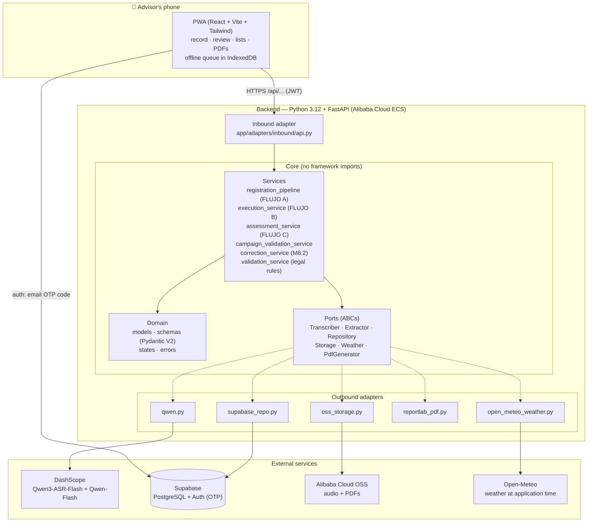
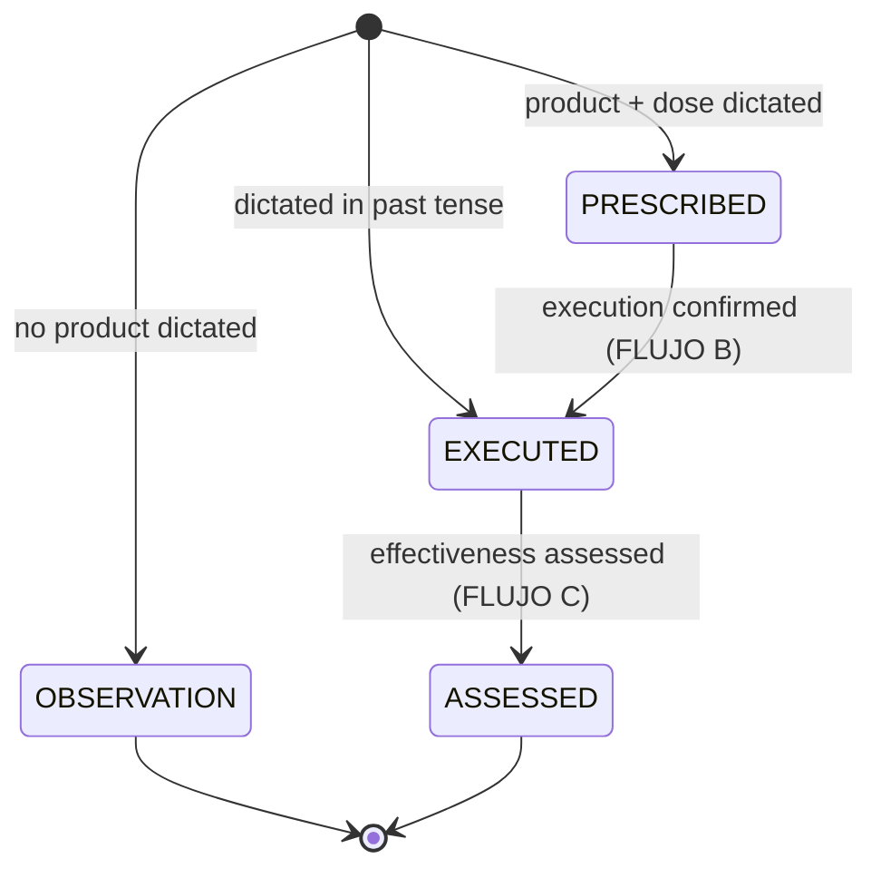

# Architecture

AgroVoz is a hexagonal (ports & adapters) application: the core knows nothing
about FastAPI, Supabase, Qwen or OSS — it only talks to abstract ports, and the
composition root (`app/config/container.py`) wires the concrete adapters in.

## System diagram



## The pipeline (FLUJO A, two-phase since M8)

1. **`POST /api/records/preview`** — audio in; Qwen3-ASR-Flash transcribes,
   Qwen-Flash extracts fields as JSON, the strict `ExtractedFields`
   Pydantic model sanitizes the output (LLM output is *untrusted input*), and
   the dictated names are resolved against the official catalogs (fuzzy lookup
   of plot/product/equipment by voice alias). Nothing is saved.
2. The advisor reviews a form with per-field ✓/⚠️ resolution markers and can
   edit anything.
3. **`POST /api/records`** — the reviewed fields go through **legal
   validation** and, only if they pass, are persisted and the official PDF is
   generated (ReportLab → OSS presigned link).

### Legal validation (`validation_service`)

Runs before anything touches the database — an illegal record is *blocked*,
never saved:

- Product authorized for the crop.
- Dose ≤ the registered maximum, **converted to the catalog's unit** first
  (0.5 hl/ha vs a 1.5 L/ha cap); unknown or incomparable units are blocked,
  never guessed.
- Treated area ≤ the SIGPAC enclosure's legal area.
- Pre-harvest interval → `earliest_harvest_date`.

Errors surface as `{"error": "DOSE_ERROR", "mensaje": "…"}` — the message is
in Spanish, readable by an agronomist.

## The record lifecycle (state machine, M5+)



No backward transitions. A correction is a **new intervention** linked via
`supersedes_intervention_id`, plus a soft-delete of the old one — legal records
are never deleted (3-year retention).

## Hard domain rules (they come from the law)

| # | Rule |
| --- | --- |
| 1 | Legal records are never deleted — soft-delete (`deleted_at`) everywhere |
| 2 | `treatment_date` = device timestamp, never the server clock (advisors record offline and sync later) |
| 3 | Idempotency via a client-generated `transaction_id` (UNIQUE) — retries can never duplicate a record |
| 4 | LLM output is untrusted — everything passes the `ExtractedFields` schema; missing mandatory field → 422, never an invented value |
| 5 | Legal validation runs **before** persisting |
| 6 | Records belong to the **holding** (owner, NIF, REA/REGEPA), not to the advisor |
| 7 | State machine with no backward transitions; corrections = supersede |
| 8 | Weather is captured when the **execution** is confirmed (real application date); if the provider fails, save with `audit_state='WEATHER_PENDING'` — never block the advisor |
| 9 | UTC in the database; `Europe/Madrid` only in PDFs |

## API surface

| Endpoint | Purpose |
| --- | --- |
| `POST /api/records/preview` | Transcribe + extract + resolve, no save (M8) |
| `POST /api/records` | Validate + persist the reviewed record (FLUJO A) |
| `GET /api/interventions` | List (today or `?from=&to=` range) |
| `GET /api/interventions/{id}` | Detail |
| `GET /api/interventions/{id}/pdf` | Official PDF (presigned link) |
| `PATCH /api/interventions/{id}/execution` | Confirm execution (FLUJO B) |
| `PATCH /api/interventions/{id}/effectiveness` | Effectiveness assessment (FLUJO C) |
| `POST /api/interventions/{id}/correction` | Supersede + soft-delete (M8.2) |
| `DELETE /api/interventions/{id}` | Soft-delete |
| `POST /api/transcribe` | Transcription only (dictation helper) |
| `GET /api/holdings` | Holdings overview for campaign validations |
| `POST /api/holdings/{id}/validations` | Sign a campaign validation (M7) |
| `GET /api/validations/{id}/pdf` | Signed validation PDF |
| `POST /api/bootstrap` | Link the auth user to the advisor profile |

## Repository layout

```
app/
  core/
    domain/      models.py · schemas.py (Pydantic V2) · states.py · errors.py
    ports/       transcriber.py · extractor.py · repository.py
                 storage.py · weather.py · pdf_generator.py  (ABCs)
    services/    registration_pipeline.py · execution_service.py
                 assessment_service.py · campaign_validation_service.py
                 correction_service.py · onboarding_service.py
                 validation_service.py
  adapters/
    inbound/     api.py (FastAPI)
    outbound/    qwen.py · supabase_repo.py · oss_storage.py
                 reportlab_pdf.py · open_meteo_weather.py
  config/        settings.py (pydantic-settings) · container.py · .env
pwa/             React + Vite + Tailwind + vite-plugin-pwa client
prompts/         extraction prompts (few-shot, in Spanish, versioned)
docs/            this file · ABOUT.md · SETUP.md · DEMO.md · USER_GUIDE.md
                 · decision log
```

Why hexagonal, even solo: swapping the weather provider (AEMET → Open-Meteo
happened mid-project) or the storage backend touches exactly one adapter, and
the services are tested end-to-end with fake ports — no network, no mocks of
third-party SDKs.
