# Demo — screen-by-screen walkthrough

### Installed PWA

AgroVoz installs from the browser as a PWA and lives on the home screen like
any native app.

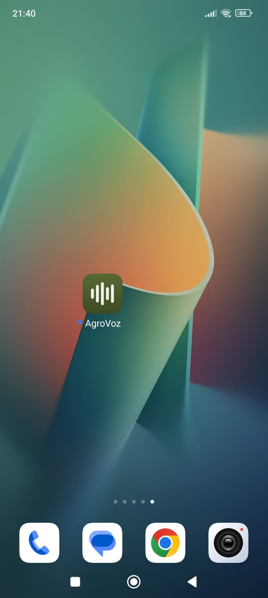

### Login (email OTP) + trial account

The advisor enters their email and receives a 6-digit one-time code; password
login is available as a secondary tab (set up in Ajustes). The form is
protected by a Cloudflare Turnstile check, and the privacy policy is linked
right below. There is no regular self-signup — advisor accounts are
provisioned by the admin — but the login screen offers **"Crear cuenta de
prueba"**: a judge can create a throwaway trial account pre-loaded with demo
catalog data (Pepe García's holding) and try the whole flow.

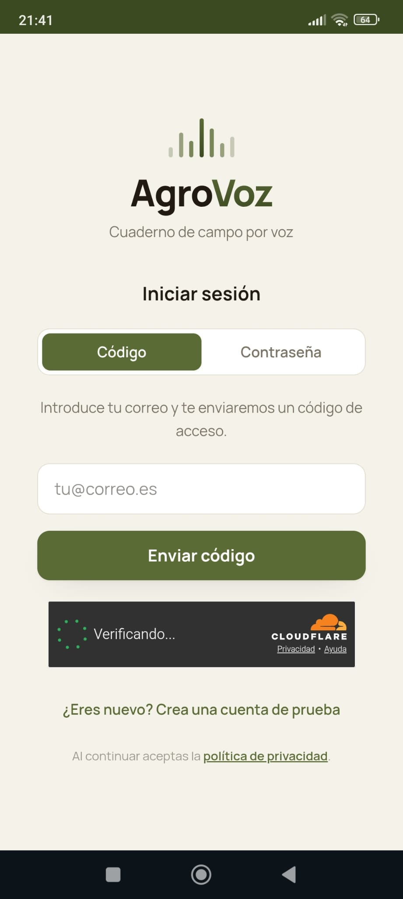 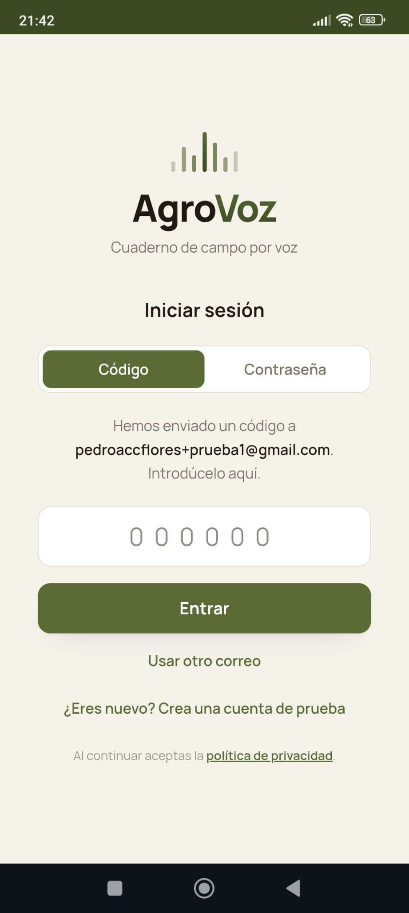 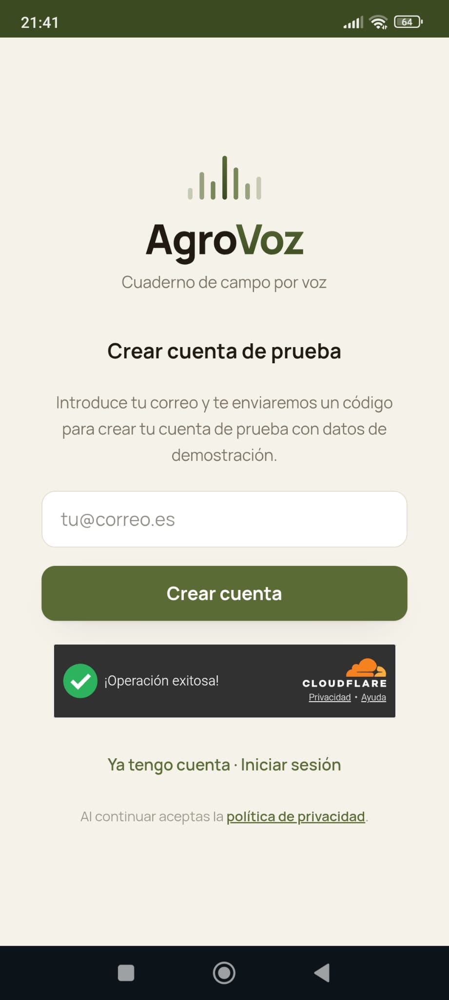

### Home — record button + today's list

One big record button and today's records ("Hoy"). Each card shows the state
badge (Prescripción / Ejecución…), the plot and holding owner, the product's
trade name and the dose + target pest. The bottom bar navigates to Historial,
Validar, Ajustes and Salir.

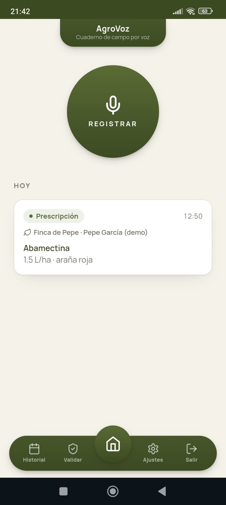

### Recording → playback → staged progress

The button turns red while recording ("Grabando — pulsa de nuevo para
terminar"). The take then appears as an audio player — the advisor can listen
before sending or discard it. "Transcribir y revisar" uploads the audio and
shows staged progress (transcribing → extracting fields) while the pipeline
runs; nothing is persisted yet.

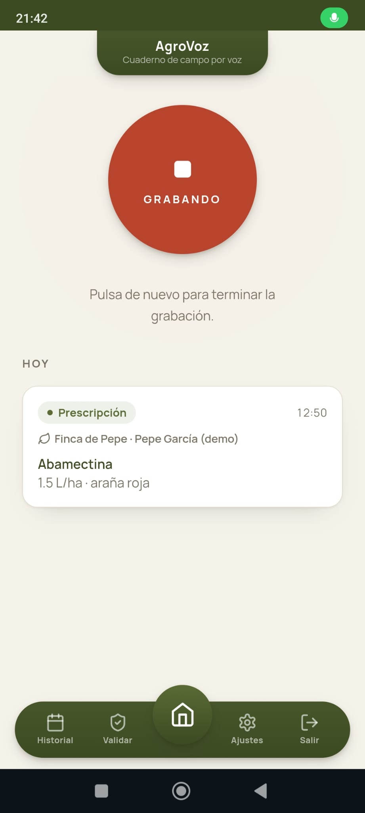 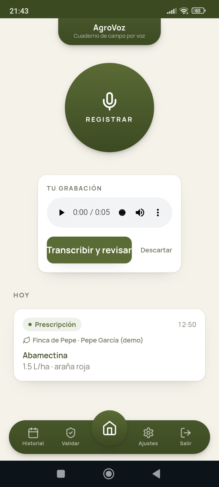 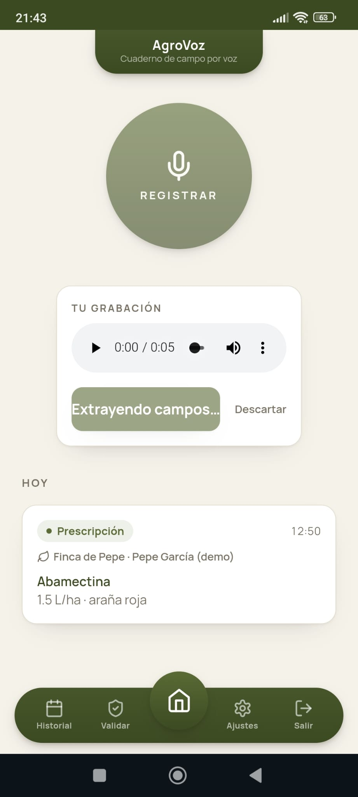

### Review before persist (two-phase flow, M8)

"Revisa antes de guardar": the transcription is quoted verbatim at the top,
the record type (Observación / Prescripción / Ejecución) is preselected, and
every extracted field comes back **prefilled but unsaved**. Identity fields
carry a resolution marker: ✓ means the dictated name was resolved against the
official catalog — the plot shows its crop and SIGPAC enclosure
(`Cítricos · SIGPAC 12:040:7:15:1`), product and equipment show "En el
catálogo". Everything is editable, and optional fields (treated area, spray
volume, operator + their ROPO, justification) can be completed by hand. Only
on "Confirmar y guardar" does the record go through legal validation and
persist.

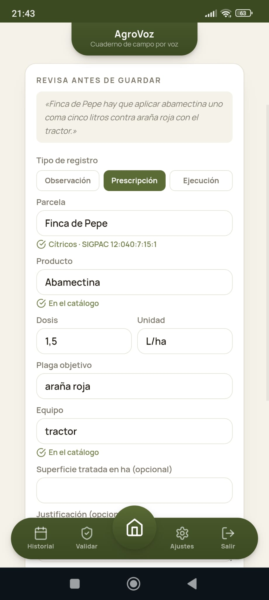

### Blocked by legal validation

An illegal record is **blocked before persisting**, with the exact reason in
Spanish. Two real examples: a dose over the product's registered maximum
(after unit conversion), and a treated area larger than the SIGPAC
enclosure's legal area.

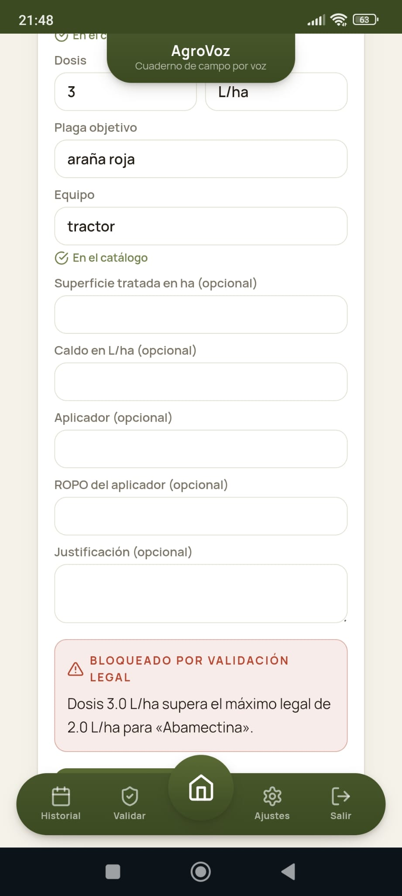 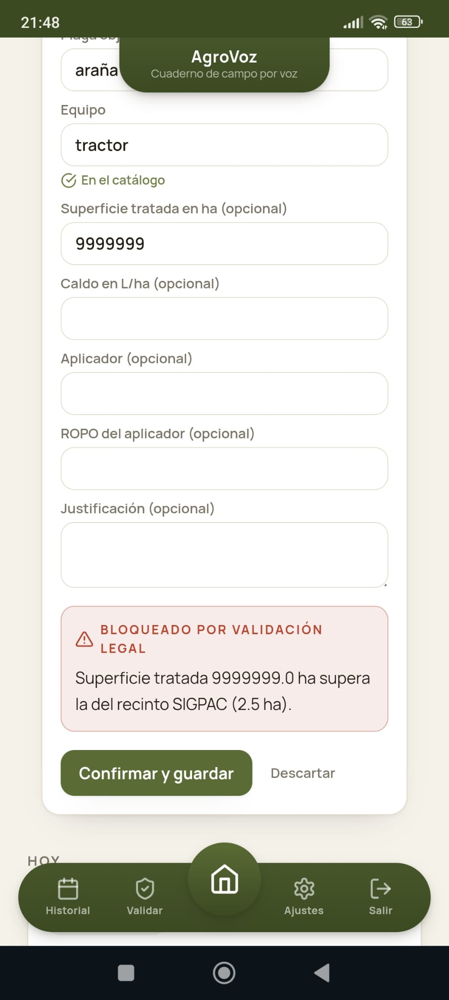

### Detail + actions

The detail screen shows every legal field (product, MAPA registration
number, dose, target pest), the holding block (owner, REA/REGEPA, SIGPAC),
and the verbatim transcription ("Lo que dictaste"). Below, the actions for
the record's state: prepare the prescription PDF, confirm execution, correct
(supersede) or delete (soft).

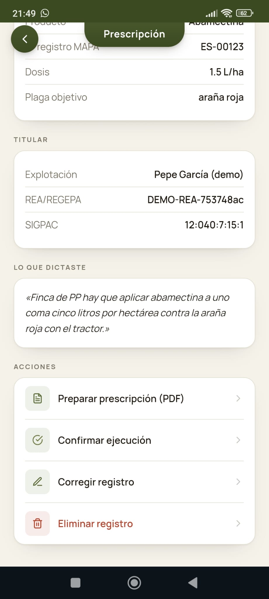

### Official PDF

"Preparar prescripción (PDF)" downloads the official document to the phone:
*Prescripción de tratamiento fitosanitario* under RD 1311/2012, with the
advisor's ROPO number, the holding (NIF, REA/REGEPA), the plot (crop, SIGPAC
enclosure, area), the prescribed treatment (active substance, MAPA
registration number, dose, target pest, equipment with its ROMA number, PHI)
and the advisor's signature line.

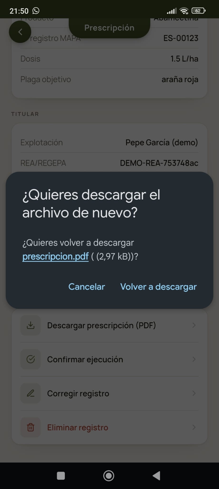 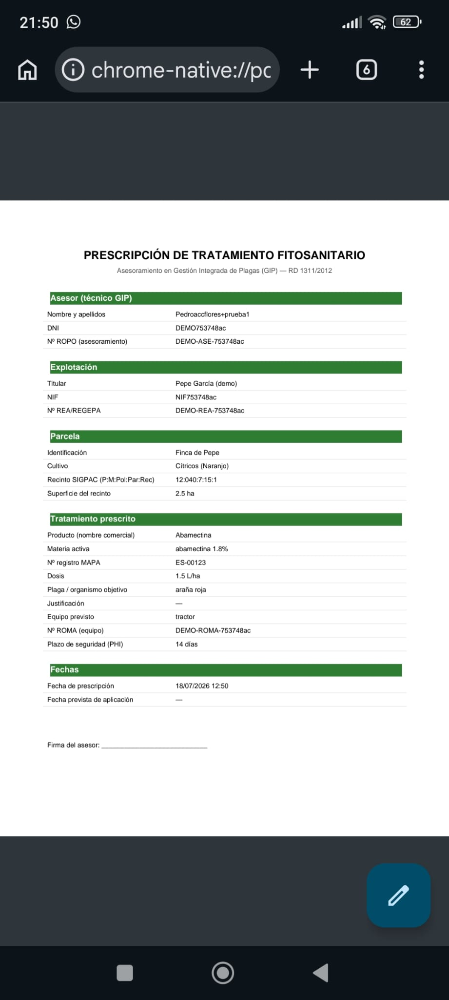

### Execution confirmation (FLUJO B)

"Confirmar ejecución" right on the detail: real application date, actual
dose, treated area, spray volume, operator and their ROPO, and the
delivery-note/invoice number — re-validated against the same legal rules.
Weather at the application time is captured automatically (Open-Meteo); if
the provider fails, the record saves as `WEATHER_PENDING` — the advisor is
never blocked.

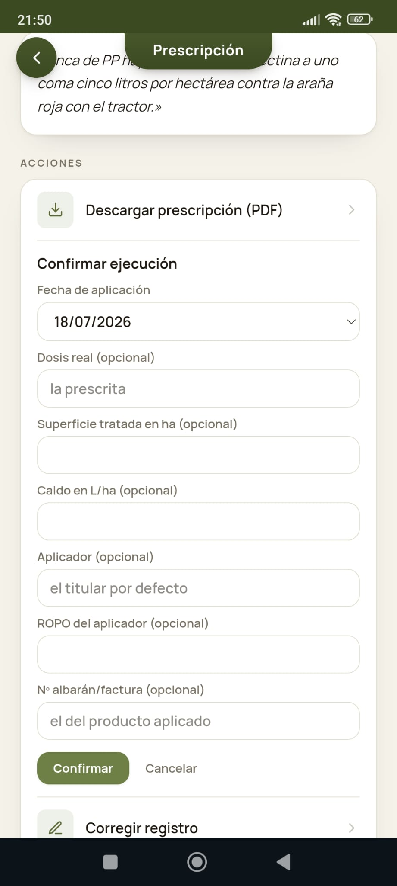

### Effectiveness assessment (M6)

Once executed, the record can be assessed: Buena / Regular / Mala, assessment
date and an optional reason — typed or **dictated with the microphone**
("Dictar el motivo").

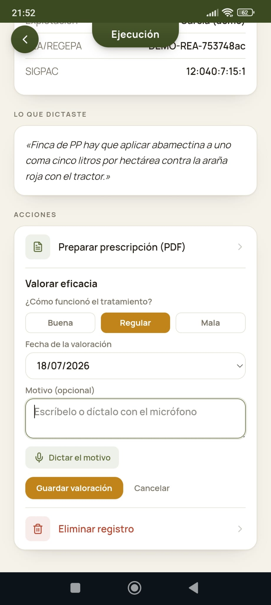

### Campaign validations (M7)

The advisor signs their conformity over a holding's records — mandatory twice
per campaign (mid-cycle + final). Grouped by holding with a per-campaign
counter (1/2 after the mid-cycle one): each validation shows its date, the
interventions covered and the verdict, and produces a validation PDF with the
advisor's conformity declaration (name + ROPO). The final sign-off asks
Conforme / No conforme with observations (dictable by voice too).

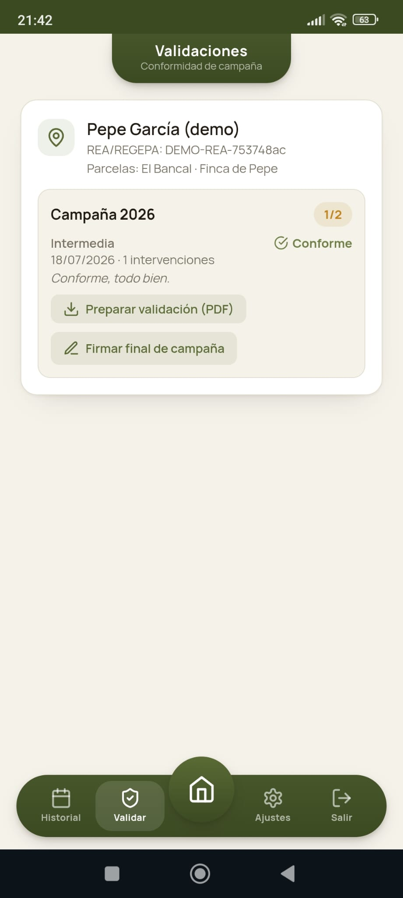 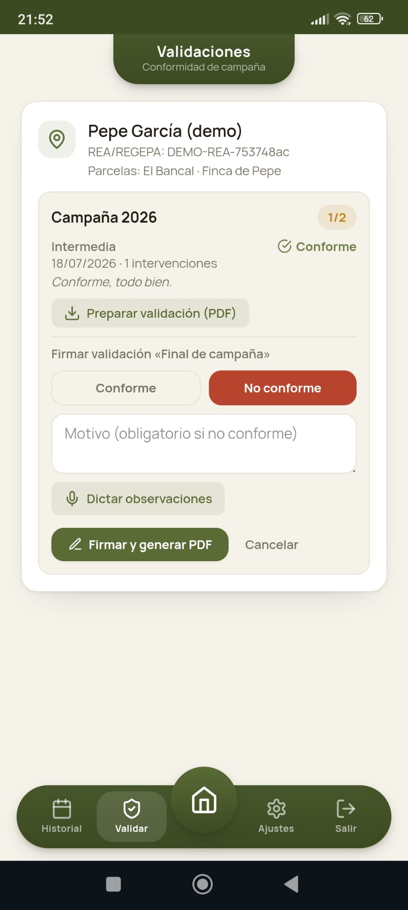

### History

Full record history with quick ranges (this month / last 30 days / all) and a
custom from/to date filter.

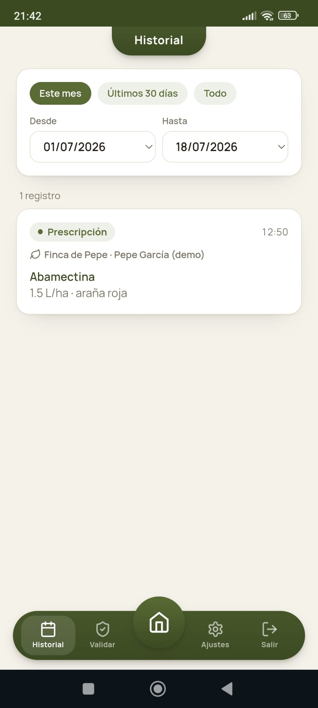

### Settings

Ajustes shows the logged-in account and lets the advisor set a password to
skip the OTP wait on future logins.

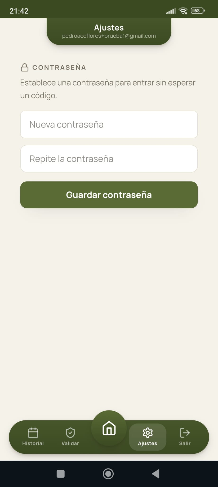

### Offline pending queue

A recording made without coverage (note the airplane-mode icon in the status
bar) is kept on the device (IndexedDB) with playback, under "Pendientes de
sincronizar" with its **original dictation timestamp** ("Dictada el…"). The
advisor retries or discards it manually once back in coverage; the retry
reuses the original idempotency key and device timestamp: nothing is lost,
nothing duplicates.

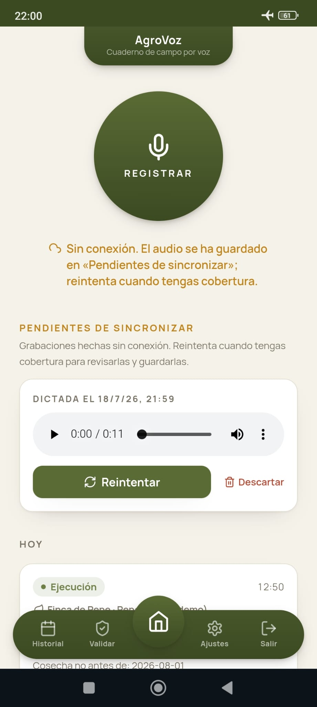
